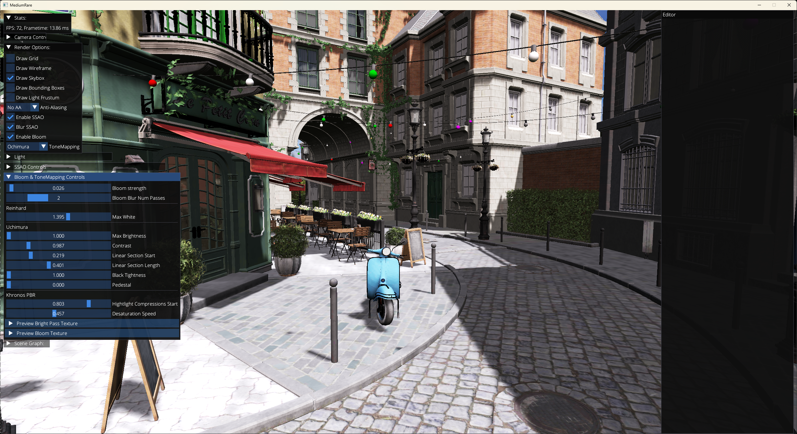

# mediumRare

This repository is used to document and showcase my progress in studying the [Vulkan 3D Graphics Rendering Cookbook - 2nd Edition](https://github.com/PacktPublishing/3D-Graphics-Rendering-Cookbook-Second-Edition/tree/main) book, by Sergey Kosarevsky, Viktor Latypov and Alexey Medvedev.

Anything outside the mediumRare directory is the template the book uses and belongs entirely to the book authors. I used the template so I won't have to deal with CMake and dependency management.

## Features
- Shadow mapping for one directional light to simulate the sun
- Skybox
- Configurable MSAA (None, x2, x4, x8, x16) at runtime
- Screen Space Ambient Occlusion
- Bloom
- Tonemapping
- Mesh optimization using [meshoptimizer](https://github.com/zeux/meshoptimizer)
